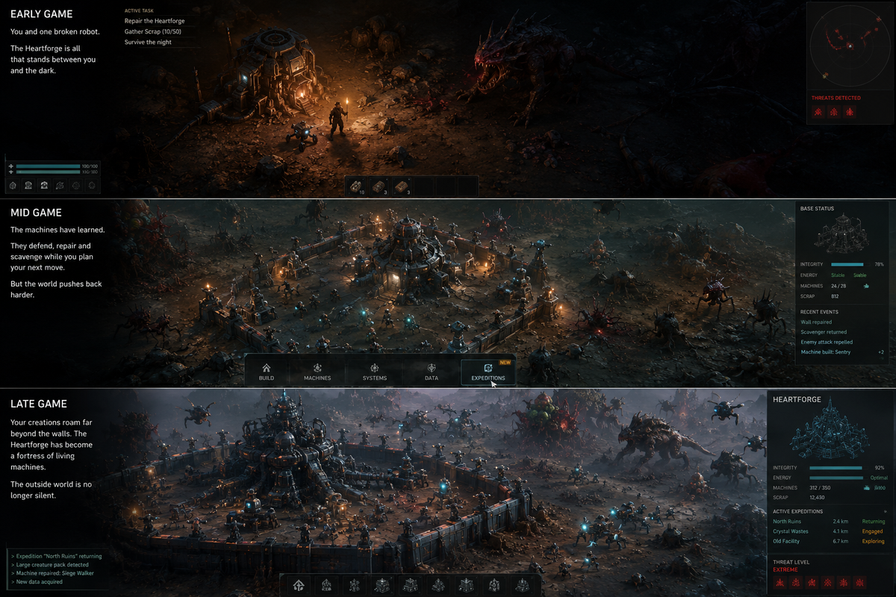

# Project Ironwight



**Project Ironwight** is a single-player, long-form survival strategy game about defending one vulnerable Heartforge in a hostile organic world. The player begins as a nearly helpless Mechromancer with one damaged robot. Over a persistent run lasting many sessions, the Heartforge and its machines learn to defend, repair, gather, scout, and conduct expeditions with progressively less supervision.

The game is not an RTS about expansion, territory, production chains, or unit micro-management. The strategic challenge is deciding what the Mechromancer, the machines, and the Heartforge should become while the outside world applies continuous pressure.

> One home. One hostile world. Machines that gradually learn to keep both themselves and their creator alive.

## Canonical product direction

- One constrained, evolving base centred on the original Heartforge.
- One ordinary stockpiled resource: **Scrap**.
- Rare discoveries are unique components or knowledge, not additional currencies.
- Organic enemies: predators, burrowers, parasites, swarms, and apex creatures. Enemy robots are outside the design.
- No scheduled-wave main loop. Major attacks are rare, causal events.
- No territory claiming, outpost network, supply-line game, or production-chain economy.
- No routine per-robot orders, loadouts, repair work, construction placement, or alert clearing.
- Robot and base autonomy must remove player work as the run progresses.
- A full successful run is expected to take many play sessions and may take 30–100 hours depending on difficulty and play style.
- Repeated failed worlds before the first victory are an intended part of learning the game.

The complete non-negotiable contract is in [`docs/DESIGN_LOCKS.md`](docs/DESIGN_LOCKS.md).

## Repository status

This is a **design-complete, implementation-ready repository scaffold**, not a finished game. It contains:

- the revised game design document;
- machine-readable design contracts for Codex and validation scripts;
- autonomy, enemy-ecology, sandbox, art, and technical design documents;
- a milestone plan and copy-ready Codex tasks;
- concept art for the intended early-, mid-, and late-game contrast;
- a minimal Godot 4.7.1 project shell that opens to a project-status screen;
- GitHub Actions validation for repository structure and design contracts.

No third-party runtime art assets are bundled. The art plan separates temporary prototype assets from the later bespoke production set.

## Start here

Read these files in order:

1. [`docs/DESIGN_LOCKS.md`](docs/DESIGN_LOCKS.md)
2. [`docs/GAME_DESIGN_DOCUMENT.md`](docs/GAME_DESIGN_DOCUMENT.md)
3. [`docs/AUTONOMY_AND_ANTI_CHORE.md`](docs/AUTONOMY_AND_ANTI_CHORE.md)
4. [`docs/ENEMY_ECOLOGY.md`](docs/ENEMY_ECOLOGY.md)
5. [`docs/PRODUCTION_ROADMAP.md`](docs/PRODUCTION_ROADMAP.md)
6. [`prompts/FIRST_CODEX_TASK.md`](prompts/FIRST_CODEX_TASK.md)

For Codex, keep the root [`AGENTS.md`](AGENTS.md) in place. It is the operational contract for implementation work.

## Local validation

```bash
python scripts/validate_repo.py
```

The minimal Godot shell is under `game/`. Open `game/project.godot` in Godot 4.7.1 or a compatible later 4.x release. It is intentionally limited to a bootstrap screen; gameplay begins with the first Codex task.

## Repository map

```text
.
├── AGENTS.md
├── README.md
├── docs/
│   ├── GAME_DESIGN_DOCUMENT.md
│   ├── DESIGN_LOCKS.md
│   ├── AUTONOMY_AND_ANTI_CHORE.md
│   ├── ENEMY_ECOLOGY.md
│   ├── LONG_RUN_SANDBOX.md
│   ├── ART_DIRECTION_AND_ASSET_PLAN.md
│   ├── TECHNICAL_ARCHITECTURE.md
│   ├── PRODUCTION_ROADMAP.md
│   ├── PLAYTEST_PLAN.md
│   └── concept-art/
├── game/
│   ├── project.godot
│   ├── data/
│   ├── scenes/
│   └── scripts/
├── prompts/
├── scripts/
└── .github/
```

## Visual target

The concept art is a direction reference, not a literal UI specification or source of production-ready models. The important progression is:

- **Early:** one weak light, one broken robot, one damaged Heartforge, and darkness close enough to feel lethal.
- **Mid:** a compact base that repairs and defends itself while the player chooses the next risk.
- **Late:** the same home transformed into a dense autonomous machine fortress, with expeditions and large formations operating beyond the walls.

The base may become visually formidable, but it must remain spatially constrained. Late-game scale comes from machine intelligence, density, and reach—not from covering the world in player-owned structures.

## Rights and assets

The concept images in this repository were generated for this project and are included as design references. Before any external asset is committed, record its source, licence, version, and modification status in [`ATTRIBUTION.md`](ATTRIBUTION.md). Do not import asset packs simply because they are convenient; visual coherence and provenance are part of the product.
